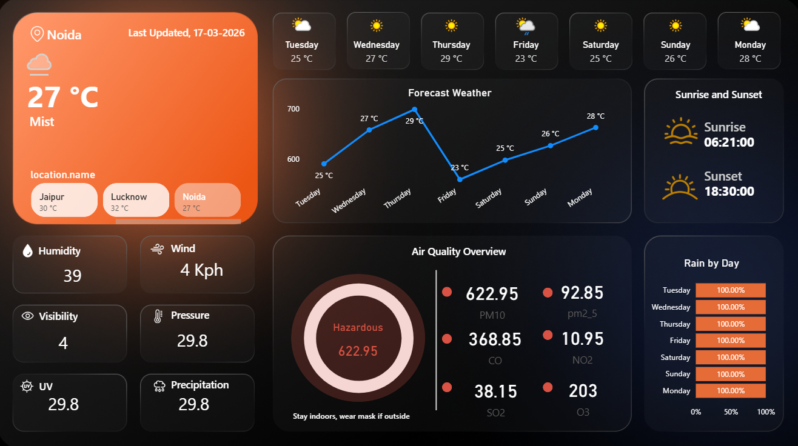

# 🌦️ Weather & Air Quality Dashboard (Power BI)

## 📊 Project Overview

This project is an interactive **Weather Forecast & Air Quality Dashboard** built using **Power BI**. It fetches real-time data using API integration and provides insights into temperature trends, weather conditions, and pollution levels across different locations.

---

## 🚀 Key Features

* 🌍 **Dynamic Location Selection** (e.g., Chandigarh, Noida, etc.)
* 📅 **Day-wise Weather Forecast Visualization**
* 🌡️ **Temperature Analysis (Avg, Current, Trends)**
* 🌫️ **Air Quality Index (AQI) Monitoring**
* 🎨 **Dynamic Color Coding for Pollutants**
* ⏱️ **Last Updated Time Display**
* 📈 Fully interactive visuals with slicers

---

## 🛠️ Tools & Technologies Used

* **Power BI Desktop**
* **DAX (Data Analysis Expressions)**
* **Power Query (ETL)**
* **REST API Integration (Weather Data)**

---

## 📌 Data Insights

* Compare weather conditions across multiple cities
* Analyze pollution levels (CO, NO₂, SO₂, O₃, PM2.5)
* Identify trends in temperature and air quality
* Understand environmental conditions visually

---

## ⚙️ Challenges Faced

* Handling **ambiguous relationships** between tables
* Fixing **data duplication issues in API data**
* Managing **date & time transformations**
* Implementing **dynamic slicers across multiple tables**
* Converting raw pollutant values into meaningful AQI indicators

---

## 💡 Learnings

* Strong understanding of **data modeling in Power BI**
* Hands-on experience with **DAX calculations & measures**
* Improved skills in **data cleaning using Power Query**
* Learned how to build **interactive dashboards for real-world data**

---

## 📷 Dashboard Preview

---

## 🔗 How to Use

1. Download the `.pbix` file
2. Open in Power BI Desktop
3. Refresh data (API required)
4. Use slicers to explore different locations and days

---

## 📌 Future Improvements

* Add more cities dynamically
* Deploy dashboard using **Power BI Service**
* Automate real-time refresh using gateway
* Enhance UI/UX with better visual design

---

## 👨‍💻 Author

**Abhishek Tripathi**
B.Tech CSE | Data Analyst Enthusiast

---

⭐ If you like this project, consider giving it a star!
